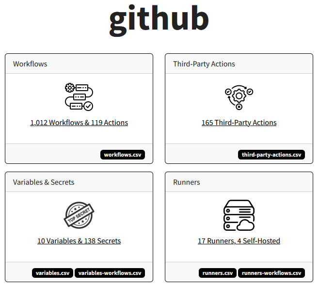
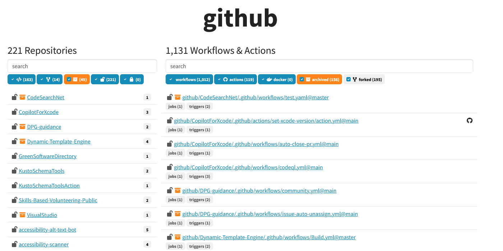
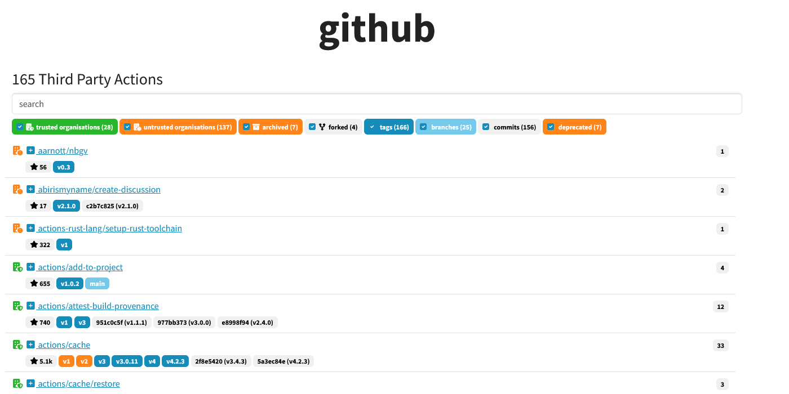
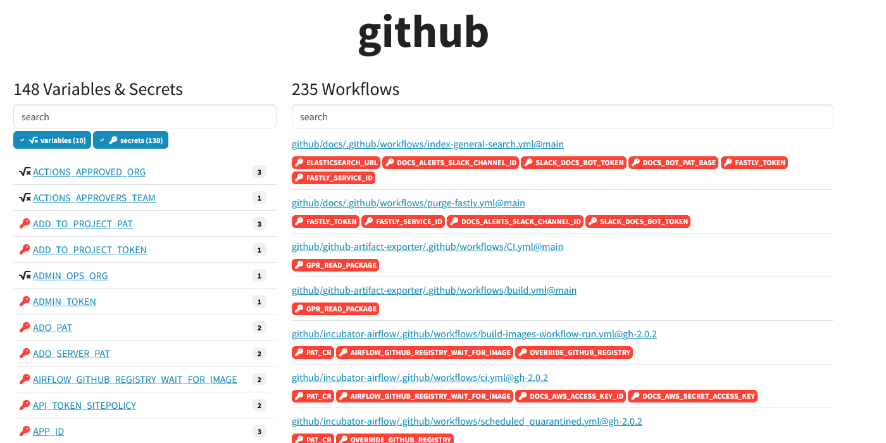

# Butler - GitHub Actions Oversight

**30 seconds pitch**

Do you know what workflows run across your GitHub org?

Butler scans every repo for workflows, actions, secrets/variables, third-party actions, and produces HTML and CSV outputs to assist with security reviews, third-party dependency audits, and workflow management.

**Screenshots**

<div align="center">

<br>



</div>

**Examples**

## Usage

Creating a view of an organisation consists of the following steps:

1. Download all repos into a local SQLite database. You can download multiple organisations into a single database file.
2. Process a database.
3. Create a report against a database.

### Installation

```
# Create virtual environment
python3 -m venv venv
. venv/bin/activate
pip3 install -r requirements.txt
```

A GitHub PAT is also required:

```
export GITHUB_TOKEN=ghp_wpB...
```

### Download

```
python butler.py download --repo "github" --database ./github.db --threads 10 --include-forks --include-archived --very-verbose
```

#### Using multiple GitHub tokens

```
export GITHUB_TOKEN_1=ghp_aaa...
export GITHUB_TOKEN_2=ghp_aaa...
...
export GITHUB_TOKEN_N=ghp_aaa...

python butler.py download [...] --token "GITHUB_TOKEN_*"
```

#### Downloading Multiple Orgs/Repos

```
python butler.py download [...] --repo "github" --repo "microsoft/vscode" --repo "openai"
```

### Process

```
python butler.py process --database ./github.db --threads 10 --very-verbose
```

### Report

```
python butler.py report --database ./github.db --output ./report --repo "github"
```
