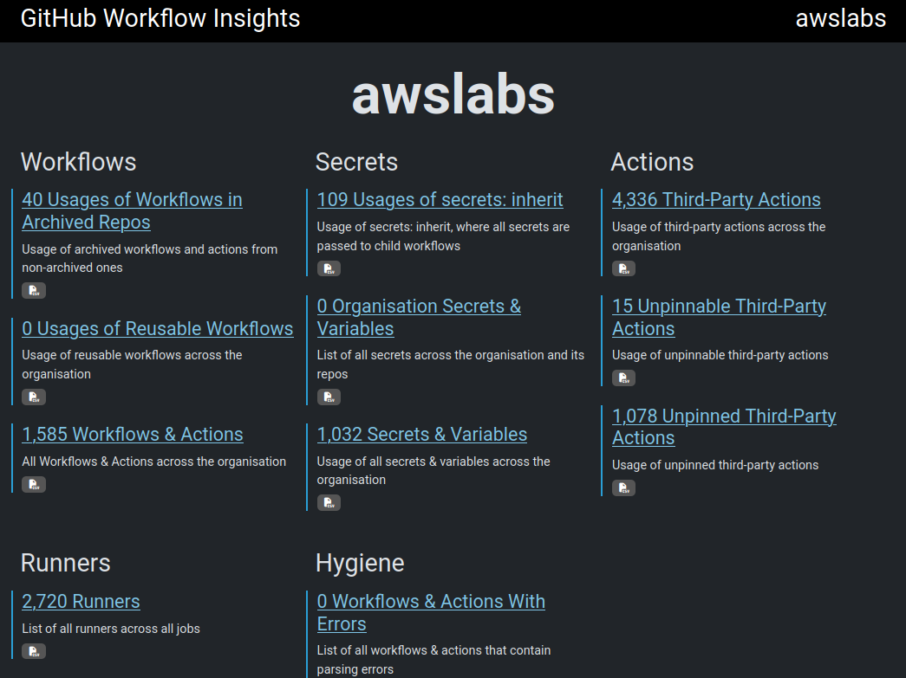
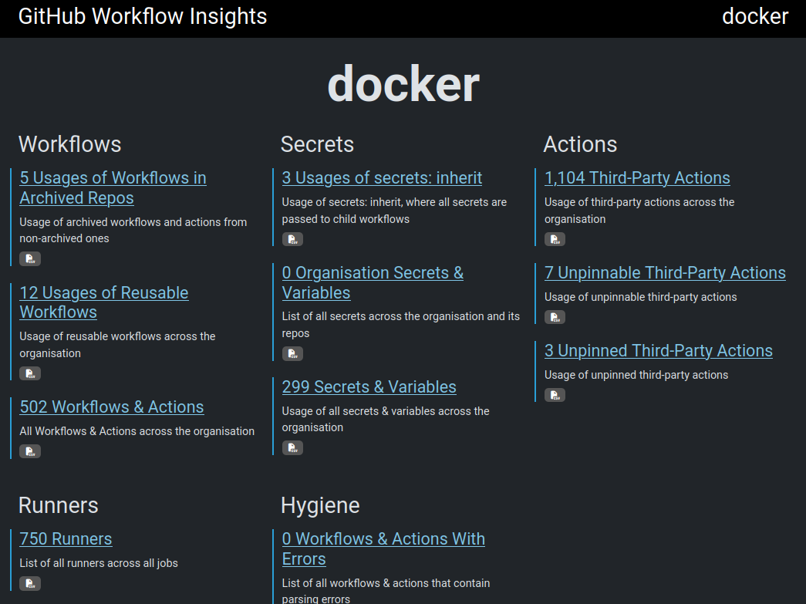
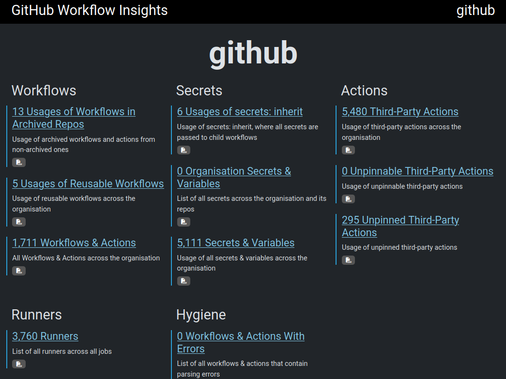
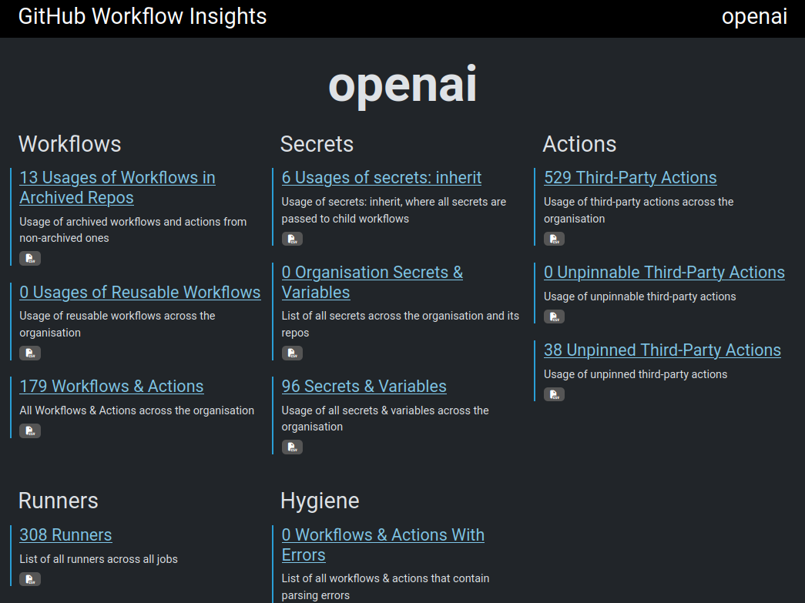
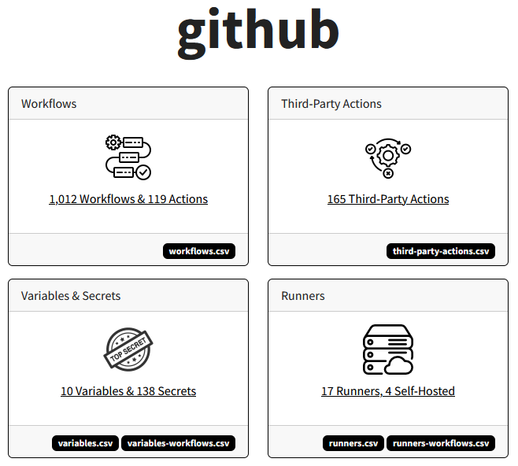
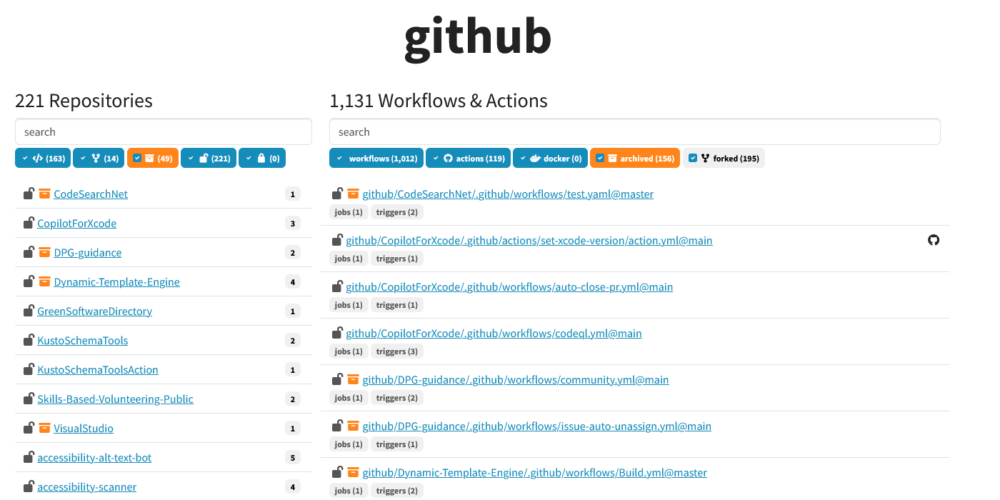
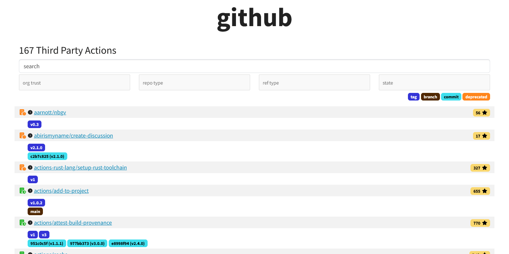
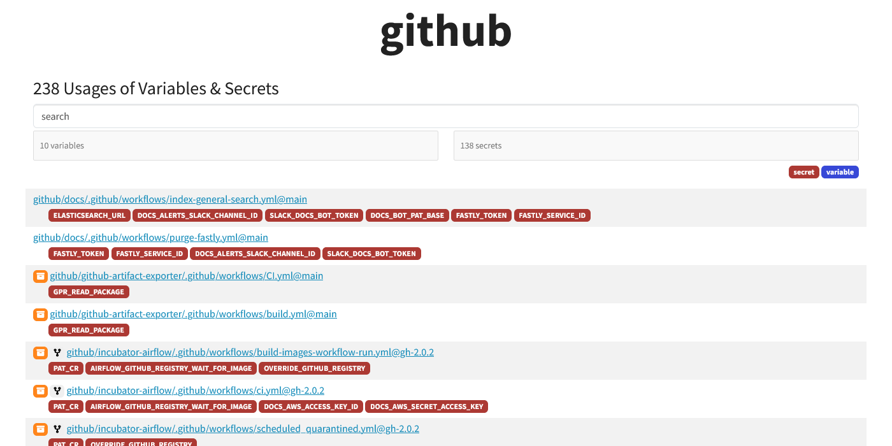

# Butler - GitHub Workflows Insights


If you have 2,000 repositories in your organisation, Butler can help you to identify:

* All workflows & actions
* All 3rd party actions, including unpinned & unpinnable actions
* All reusable workflows
    * Active workflows referencing reusable workflows/actions from archived repos
* Usage of missing actions and/or references to invalid tags/branches
* All runners across workflows, including unsupported ones
* All organisation & repo secrets and variables
  * Secrets & variables usage
  * Usage of `secrets: inherit` across workflows
* Workflows and actions that have invalid yaml files

## Samples

[Click here for sample reports for organisations like GitHub, OpenAI, Docker, AWS Labs](https://sadreck.github.io/Butler/) - **not** mobile friendly.

**Screenshots**

<div align="center">


<br>


</div>

<!--
<div align="center">

<br>



</div>
-->

# Usage

## GitHub Tokens

### Permissions

| Scope | Permission           | Classic PAT  | Fine-Grained Token | GitHub App  |
|------|----------------------|--------------|-------------------|-------------|
| Repo | `Agent Secrets`      |              | Optional          | Optional    |
| Repo | `Agent Variables`    |              | Optional          | Optional    |
| Repo | `Contents`           |              | **Required**      | **Required** |
| Repo | `Dependabot Secrets` |              | Optional          | Optional    |
| Repo | `Secrets`            |              | Optional          | Optional    |
| Repo | `Variables`          |              | Optional          | Optional    |
| Org  | `Agent Secrets`      |              | Optional          | Optional    |
| Org  | `Agent Variables`    |              | Optional          | Optional    |
| Org  | `Dependabot Secrets` |              | Optional          | Optional    |
| Org  | `Secrets`            |              | Optional          | Optional    |
| Org  | `Variables`          |              | Optional          | Optional    |
| N/A | `repo`               | **Required** |                   |             |
| N/A | `admin:org`          | Optional     |                   |             |

### Installation

```
# Create virtual environment
python3 -m venv venv
. venv/bin/activate
pip3 install -r requirements.txt
```

### Usage

By default, Butler reads the PAT from the `GITHUB_TOKEN` environment variable.

**Default Environment Variable**

```
export GITHUB_TOKEN=ghp_wpB...
```

**Using a Different Variable**

```
export MY_TOKEN=ghp_wpB...

# Pass name via --token
python butler.py [...] --token "MY_TOKEN"
```

**Using Multiple GitHub Tokens**

```
export GITHUB_TOKEN_1=ghp_aaa...
export GITHUB_TOKEN_2=ghp_aaa...
...
export GITHUB_TOKEN_N=ghp_aaa...

python butler.py [...] --token "GITHUB_TOKEN_*"
```

**Using a GitHub App**

```
export GITHUB_APP_KEY=$(cat /path/to/gh-app-key.pem)

# Pass key to --gh-app-key
python butler.py [...] --gh-app-key "GITHUB_APP_KEY" --gh-app-installation-id "1234567" --gh-app-client-id "Iv23liR6..."
```

### Workflow Data Collection

The first step is to collect all workflows and actions from repositories.

```
--repo REPO           Target formatted as: org, org/name, or org/name@branch. To load targets from file use an absolute path or a path starting with ./
--workflow WORKFLOW   Download specific workflows, extension is optional
--database DATABASE   Path to SQLite database to create or connect to
--resume-next         Resume downloads on server errors
--all-branches        Download all branches, only works with --repo
--all-tags            Download all tags, only works with --repo
--include-forks       Include forked repos when --repo is an org
--include-archived    Include archived repos when --repo is an org
--all-repos           Download all repos, including archived and forks
--threads THREADS     Enable multithreading
--verbose, -v         Debug output
--very-verbose, -vv   Trace output
```

**Download Entire Org**

```
python butler.py download --repo "microsoft" --all-repos --threads 10 --very-verbose --database microsoft.db
```

**Download Single Repo**

```
python butler.py download --repo "microsoft/vscode" --very-verbose --database microsoft-vscode.db
```

**Download All Tags/Branches for a Repo**

```
python butler.py download --repo "microsoft/vscode" --very-verbose --database microsoft-vscode.db --all-branches --all-tags
```

### Organisation & Repository Secret Collection

This feature is optional and requires additional permissions (see table above), ideally a GitHub App installed in the Org.

```
--org ORG             Organisation to download secrets and variables for
--database DATABASE   Path to SQLite database to create or connect to
--resume-next         Resume downloads on server errors
--threads THREADS     Enable multithreading
```

**Example**

```
python butler.py secrets_and_vars --org "microsoft" --database ./data/microsoft.db --very-verbose --gh-app-key ...
```

### Data Processing

Once all workflows are collected they need to be processed.

```
--database DATABASE   Path to SQLite database to create or connect to
--threads THREADS     Enable multithreading
--verbose, -v         Debug output
--very-verbose, -vv   Trace output
```

**Example**

```
python butler.py process --database ./microsoft.db --threads 10 --very-verbose
```

### Report Generation

Finally, generate a report to view the results.

```
--database DATABASE   Path to SQLite database to create or connect to
--repo REPO           Repo to generate report from
--output OUTPUT       Location to store output files
--config CONFIG       Configuration file (defaults to default_config.yaml)
--custom-query-path CUSTOM_QUERY_PATH
                    Path to custom query yaml files
```

**Default Report**

```
python butler.py report --database ./microsoft.db --output ./report --repo "github"
```

**Use Custom Configuration**

By default, the configuration used for generating reports is `.src/commands/report/default_config.yaml`. To use a custom version use the `--config` argument.

```
python butler.py report --database ./microsoft.db --output ./report --repo "github" --config ./custom-config.yaml
```

**Custom Queries**

Default queries are stored in `./src/commands/report/queries`, [to write custom queries use this guide](./docs/writing_custom_queries.md).

```
python butler.py report --database ./microsoft.db --output ./report --repo "github" --custom-query-path ./my-queries
```

#### Writing Custom Queries

<details>
  <summary>For the custom query reference click here</summary>

  ```yaml
# Only v2.0 is supported.
version: '2.0'
# Name of query, will appear as the hyperlink/title in the report.
name: 'Usages of Workflows in Archived Repos'
# Short description, will appear under the hyperlink/title in the report.
description: 'Usage of archived workflows and actions from non-archived ones'
# CSV/HTML filename that results will be written to.
filename: 'archived-workflows-usage'
# Group under which these results will appear in the report, supported values are:
#   * actions
#   * hygiene
#   * runners
#   * secrets
#   * workflows
group: 'workflows'
# SQL query, filtering by the organisation the report is being generated for can use the :org placeholder.
sql: |
  # Filter by org.
  SELECT * FROM organisations WHERE id = :org;
  
  # Filter by trusted orgs.
  SELECT * FROM organisations WHERE id NOT IN (:org, $_TRUSTED_ORGS_$)
  
  # Filter by runners.
  SELECT * FROM job_data WHERE jd.value NOT IN($_UNSUPPORTED_RUNNERS_$)
# The keys to columns are the names that are returned from the query.
columns:
  # Hide a column.
  org_name: hide

  # This column must be in the results, like "SELECT name AS repo_name FROM repositories"
  repo_name:
    # Table header label.
    label: 'Repository'
    # Result values will be URL links and use the value of whichever column the 'link' property points to.
    type: 'link'
    link: 'repo_url'
    # Filtering available for the column, available values are:
    #   * list: Display a list of all values and allow text searches.
    #   * list-no-search: Display a list of all values and disable text searches.
    filters:
      column_control_alias: 'list'
  archived:
    label: 'Archived'
    # Value alignment, bootstrap class and one of:
    #   * text-start (default)
    #   * text-center
    #   * text-end
    align: 'text-center'
    # Display an icon based on a 1 or 0 value.
    type: 'icon'
    format:
      # Bootstrap class when value is 1.
      style_true: 'text-warning'
      # Bootstrap class when value is 0.
      style_false: 'text-info'
  category:
    # Map query raw values to hardcoded ones, '_' is a catch-all/default value (when omitted the raw column value will be displayed)
    value_mapping:
      actions: 'Actions'
      agents: 'Agents'
      dependabot: 'Dependabot'
      _: 'Default'
    popup:
      # The values will have a link which will show a popup with whichever values appear in wherever the 'field' property is pointing.
      # Values must be comma-separated and will be displayed as a list.
      title: 'Repositories'
      field: 'selected_repos'
  ```
</details>
